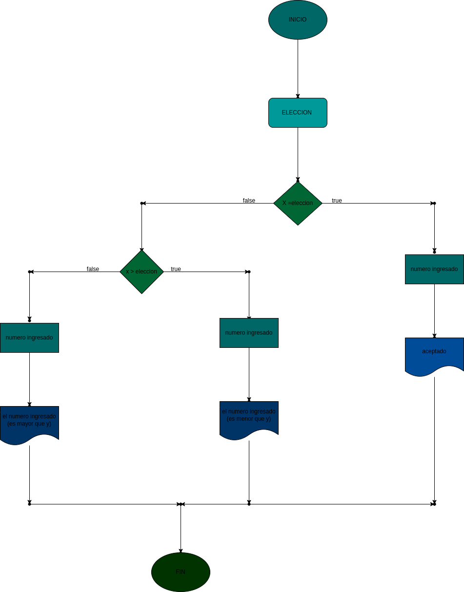

# adivinar el numero
programa para adivinar un numero aleatorio

analisis

variable de entrada (imput)

variable del proceso y salida (processing,storange,output)

r = resultado de la verificacion nummero es mayor o menor

# DISEÑO

# construccion
